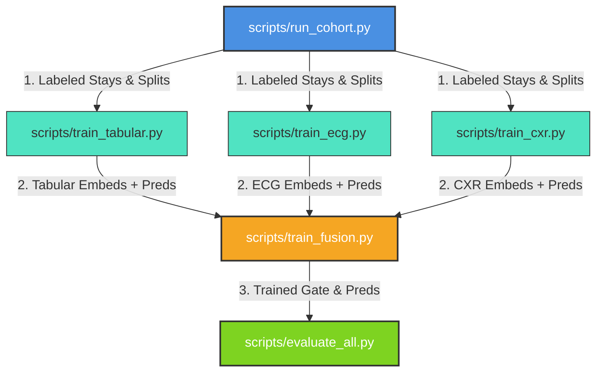

# Multimodal Heart Failure 30-Day Readmission Prediction: Repository Overview

This repository implements a three-branch multimodal machine learning system to predict 30-day unplanned heart failure (HF) hospital readmissions using data from the MIMIC-IV, MIMIC-IV-ECG, and MIMIC-CXR databases. 

The core contribution is a **learned gating fusion layer trained with modality-dropout** that allows the system to remain highly robust and calibrated even when some modalities (e.g., ECG or Chest X-Ray) are missing at inference time.

---

## 1. System Architecture

The overall system structure is shown below:

```
                          ┌──────────────────────────┐
                          │    Patient Admission     │
                          └─────────────┬────────────┘
                                        │
             ┌──────────────────────────┼──────────────────────────┐
             ▼                          ▼                          ▼
     ┌───────────────┐          ┌───────────────┐          ┌───────────────┐
     │ Tabular (EHR) │          │  12-Lead ECG  │          │  Chest X-Ray  │
     │ Demographics, │          │ 10s Waveform  │          │ Frontal Image │
     │ Labs, Vitals  │          │   (500 Hz)    │          │   (224x224)   │
     └───────┬───────┘          └───────┬───────┘          └───────┬───────┘
             │                          │                          │
             ▼                          ▼                          ▼
     ┌───────────────┐          ┌───────────────┐          ┌───────────────┐
     │ XGBoost Boot- │          │   1D ResNet   │          │ DenseNet-121  │
     │ strap Ensemble│          │  + MC-Dropout │          │  + MC-Dropout │
     │    (N=20)     │          │   (Frozen)    │          │   (Frozen)    │
     └───────┬───────┘          └───────┬───────┘          └───────┬───────┘
             │                          │                          │
    Score + Confidence         Score + Confidence         Score + Confidence
    + Feature Vector           + Embedding                + Embedding
             │                          │                          │
             └──────────────────────────┼──────────────────────────┘
                                        │
                                        ▼
                          ┌──────────────────────────┐
                          │  Learned Gating Fusion   │
                          │   (Modality-Dropout)     │
                          └─────────────┬────────────┘
                                        │
                                        ▼
                          ┌──────────────────────────┐
                          │  30-Day Readmission Risk │
                          └──────────────────────────┘
```

The system processes three input streams:
1. **EHR / Tabular Branch**: Preprocessed using median imputation. Fits an ensemble of 20 XGBoost models trained on bootstrap resamples. The mean probability is the risk score, and confidence is derived from the standard deviation of prediction probabilities.
2. **12-Lead ECG Branch**: Preprocessed with bandpass filtering (0.5–40 Hz), resampling to 500 Hz, padding/trimming to 5,000 samples, and lead-wise Z-score normalization. Classifies using a 1D ResNet with MC-Dropout (stochastic forward passes) to compute risk score, embedding, and model confidence.
3. **Chest X-Ray (CXR) Branch**: Preprocessed by resizing to 224x224 and applying ImageNet normalization. Utilizes a frozen DenseNet-121 backbone from `timm` with a trainable linear projection + classification head. Uses MC-Dropout for risk, embedding, and model confidence.
4. **Fusion Layer**: Receives the projected embeddings, confidences, and availability flags from the three branches. It either calculates a baseline **Fixed-Weight Average** (masked by modality availability) or feeds them to a **Gated Fusion Model** (trained with $p=0.3$ modality-dropout) to output a final readmission risk score.

---

## 2. Directory & Module Breakdown

The code is divided into standard python packages in the [src/](file:///c:/DA/Coding/Healthcare%20Data%20Analytics%20DA/HealthCare_Analytics/src) directory:

### Cohort Extraction & Splitting (`src/cohort`)
* **[extract_cohort.py](file:///c:/DA/Coding/Healthcare%20Data%20Analytics%20DA/HealthCare_Analytics/src/cohort/extract_cohort.py)**: Filters primary-diagnosis HF admissions (ICD-9/10), excludes in-hospital deaths, and labels unplanned 30-day readmissions. Also extracts demographic features, length of stay, admission acuity, and computes prior visit counts (needed for clinical baselines).
* **[split.py](file:///c:/DA/Coding/Healthcare%20Data%20Analytics%20DA/HealthCare_Analytics/src/cohort/split.py)**: Performs patient-level (subject-level) stratified splitting (70% train / 10% val / 20% test) to prevent data leakage (a patient's multiple stays never overlap across splits).

### Tabular EHR Branch (`src/tabular`)
* **[features.py](file:///c:/DA/Coding/Healthcare%20Data%20Analytics%20DA/HealthCare_Analytics/src/tabular/features.py)**: Processes raw MIMIC-IV tables. Compiles demographic variables, administrative metadata (LOS, prior visits), last-48h vitals (min/max/mean of SBP, DBP, HR, SpO2, RR, Temp), and last-72h labs (closest to discharge for BNP/NT-proBNP, creatinine, sodium, hemoglobin, etc.).
* **[impute.py](file:///c:/DA/Coding/Healthcare%20Data%20Analytics%20DA/HealthCare_Analytics/src/tabular/impute.py)**: Simple median imputation fitted on the train split only, which is then applied to validation/test sets to prevent leakage.
* **[model.py](file:///c:/DA/Coding/Healthcare%20Data%20Analytics%20DA/HealthCare_Analytics/src/tabular/model.py)**: Defines `TabularEnsemble`, a bootstrap ensemble of XGBoost models. Generates probability, prediction standard deviation, confidence, and feature importance.

### 12-Lead ECG Branch (`src/ecg`)
* **[preprocess.py](file:///c:/DA/Coding/Healthcare%20Data%20Analytics%20DA/HealthCare_Analytics/src/ecg/preprocess.py)**: Identifies the ECG record closest to discharge (within 72h). Loads signals using WFDB, applies a 0.5-40 Hz bandpass filter, resamples to 500 Hz, pads/trims to 5000 samples, and Z-score normalizes.
* **[dataset.py](file:///c:/DA/Coding/Healthcare%20Data%20Analytics%20DA/HealthCare_Analytics/src/ecg/dataset.py)**: PyTorch `ECGDataset` and DataLoader factory. For admissions missing ECGs, it yields a zero tensor and sets the `available` flag to `0.0`.
* **[model.py](file:///c:/DA/Coding/Healthcare%20Data%20Analytics%20DA/HealthCare_Analytics/src/ecg/model.py)**: Implements `ECGResNet` (1D ResNet with stem conv + 4 residual blocks + pooling + dropout). Includes `mc_predict_ecg` to run stochastic forward passes for uncertainty estimation.

### Chest X-Ray Branch (`src/cxr`)
* **[preprocess.py](file:///c:/DA/Coding/Healthcare%20Data%20Analytics%20DA/HealthCare_Analytics/src/cxr/preprocess.py)**: Identifies the frontal CXR image closest to discharge (within 72h). Loads JPEG images, crops/resizes to 224x224, and applies ImageNet statistics. Includes random augmentation during training.
* **[dataset.py](file:///c:/DA/Coding/Healthcare%20Data%20Analytics%20DA/HealthCare_Analytics/src/cxr/dataset.py)**: PyTorch `CXRDataset` mapping stays to preprocessed image paths. Missing images return zeros and an availability flag of `0.0`.
* **[model.py](file:///c:/DA/Coding/Healthcare%20Data%20Analytics%20DA/HealthCare_Analytics/src/cxr/model.py)**: Implements `CXREncoder` wrapping a pretrained DenseNet-121 backbone from `timm` (frozen by default) with a trainable linear projection + classification head. Supports MC-dropout inference.

### Clinical Baselines (`src/baselines`)
* **[lace.py](file:///c:/DA/Coding/Healthcare%20Data%20Analytics%20DA/HealthCare_Analytics/src/baselines/lace.py)**: Computes the **LACE index** (Length of stay, Acuity, Comorbidities [Charlson index computed via `comorbidipy` or fallback prefix mapping], Emergency department visits in the last 6 months).
* **[hospital_score.py](file:///c:/DA/Coding/Healthcare%20Data%20Analytics%20DA/HealthCare_Analytics/src/baselines/hospital_score.py)**: Computes the **HOSPITAL score** (Hemoglobin < 12, Oncology service, Sodium < 135, Procedure during stay, Index admission acuity, prior admissions in 12m, LOS >= 5 days). Both baselines are calibrated to probabilities using logistic regression on the training set.

### Modality Fusion (`src/fusion`)
* **[fixed_weight.py](file:///c:/DA/Coding/Healthcare%20Data%20Analytics%20DA/HealthCare_Analytics/src/fusion/fixed_weight.py)**: Baseline confidence-weighted average score fusion.
* **[learned_gate.py](file:///c:/DA/Coding/Healthcare%20Data%20Analytics%20DA/HealthCare_Analytics/src/fusion/learned_gate.py)**: Defines `GatedFusionModel`. Tabular, ECG, and CXR embeddings are projected to a unified 256-D space. A Gate MLP takes projected representations + confidences + availability, masking out unavailable branches to $-\infty$ before softmax. The final prediction logit is generated from the weighted sum. Modality-dropout randomly zeros out ECG or CXR inputs during training to enforce routing flexibility.

### System Evaluation (`src/evaluation`)
* **[metrics.py](file:///c:/DA/Coding/Healthcare%20Data%20Analytics%20DA/HealthCare_Analytics/src/evaluation/metrics.py)**: Computes classification discrimination (AUROC, AUPRC) and calibration accuracy (Brier score, Expected Calibration Error [ECE]).
* **[decision_curve.py](file:///c:/DA/Coding/Healthcare%20Data%20Analytics%20DA/HealthCare_Analytics/src/evaluation/decision_curve.py)**: Implements Decision Curve Analysis (DCA) to measure clinical net utility of predicting readmissions against traditional strategies (treat-all, treat-none).
* **[fairness.py](file:///c:/DA/Coding/Healthcare%20Data%20Analytics%20DA/HealthCare_Analytics/src/evaluation/fairness.py)**: Evaluates performance gaps across demographic groups (e.g., gender, age bands).
* **[missingness_sweep.py](file:///c:/DA/Coding/Healthcare%20Data%20Analytics%20DA/HealthCare_Analytics/src/evaluation/missingness_sweep.py)**: Sweeps all 7 available modality subsets (Tabular, ECG, CXR, and their combinations) to evaluate performance degradation.

### Explainability (`src/explainability`)
* **[shap_tabular.py](file:///c:/DA/Coding/Healthcare%20Data%20Analytics%20DA/HealthCare_Analytics/src/explainability/shap_tabular.py)**: Uses SHAP TreeExplainer on the XGBoost branch to generate beeswarm, bar, and individual patient waterfall charts.
* **[gradcam_cxr.py](file:///c:/DA/Coding/Healthcare%20Data%20Analytics%20DA/HealthCare_Analytics/src/explainability/gradcam_cxr.py)**: Computes Grad-CAM heatmaps for the DenseNet-121 CXR backbone to highlight pathology locations.

### Utilities & Demo (`src/utils`, `src/demo`)
* **[config.py](file:///c:/DA/Coding/Healthcare%20Data%20Analytics%20DA/HealthCare_Analytics/src/utils/config.py)**: Central YAML configuration loader via OmegaConf.
* **[logger.py](file:///c:/DA/Coding/Healthcare%20Data%20Analytics%20DA/HealthCare_Analytics/src/utils/logger.py)**: Initializes stdout logging and MLflow tracking.
* **[seed.py](file:///c:/DA/Coding/Healthcare%20Data%20Analytics%20DA/HealthCare_Analytics/src/utils/seed.py)**: Sets global reproducibility seeds across Python, NumPy, PyTorch, and XGBoost.
* **[app.py](file:///c:/DA/Coding/Healthcare%20Data%20Analytics%20DA/HealthCare_Analytics/src/demo/app.py)** & **[case_studies.py](file:///c:/DA/Coding/Healthcare%20Data%20Analytics%20DA/HealthCare_Analytics/src/demo/case_studies.py)**: Streamlit dashboard showcasing models, case study walks, and real-time missingness simulations.

---

## 3. Pipeline Workflow

Training and evaluation scripts are structured sequentially in [scripts/](file:///c:/DA/Coding/Healthcare%20Data%20Analytics%20DA/HealthCare_Analytics/scripts):



1. **`run_cohort.py`**: Extracts the cohorts and saves `train.parquet`, `val.parquet`, and `test.parquet`.
2. **Branch Training**:
   * **`train_tabular.py`**: Fits the simple median imputer, trains the XGBoost ensemble on bootstrap samples, saves the prediction scores, and outputs the raw tabular feature matrix as `tabular_embed_<split>.npy`.
   * **`train_ecg.py`**: Runs PyTorch training for `ECGResNet` on stays that have ECGs. Performs MC-Dropout inference and saves predicted scores + averaged embeddings (`ecg_embed_<split>.npy`).
   * **`train_cxr.py`**: Trains the head of `CXREncoder` while the DenseNet-121 backbone is frozen. Runs MC-Dropout to produce prediction scores + averaged image embeddings (`cxr_embed_<split>.npy`).
3. **`train_fusion.py`**: Aggregates the branch outputs (scores, embeddings, confidences, and availability flags) to train the `GatedFusionModel` using modality-dropout augmentation.
4. **`evaluate_all.py`**: Evaluates LACE/HOSPITAL baselines, conducts the 7-modality missingness sweep, builds the Decision Curve Analysis utility, and generates subgroup fairness reports. Saves all logs, metric comparisons, and figures.

---

## 4. Project Tracking Files

Three tracking files are maintained alongside this overview to keep an up-to-date record of the repository structure:

| File | Purpose | Update When |
|------|---------|-------------|
| [`project_tree.md`](file:///c:/DA/Coding/Healthcare%20Data%20Analytics%20DA/HealthCare_Analytics/project_tree.md) | Full directory tree with annotations and runtime directory notes | Files added/removed/renamed |
| [`dependency_graph.md`](file:///c:/DA/Coding/Healthcare%20Data%20Analytics%20DA/HealthCare_Analytics/dependency_graph.md) | Pipeline data flow, internal module dependencies, external library graph, per-module dependency table | Imports change or pipeline steps modified |
| [`file_metadata.md`](file:///c:/DA/Coding/Healthcare%20Data%20Analytics%20DA/HealthCare_Analytics/file_metadata.md) | Per-file metadata: purpose, imports, exports, classes, functions, line counts | Files added/modified |

> **Note**: `.venv/`, `venv/`, `env/`, `__pycache__/`, `data/`, `outputs/`, `.streamlit/`, and similar generated/excluded directories are documented in `project_tree.md` but not tracked by Git.
